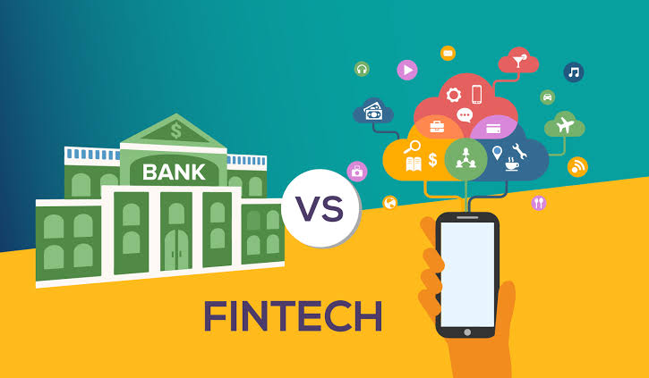

<!-- Initial statement -->
# Fintech disrupts traditional institions
Recent years the Fintech Industry has exploded. 
As a result, traditional institions 
such as bank has been disrupted. 

<!-- Solutions-->
Now banks are adapting fintech to revolutionalize their own functions: 
**Online banking App, etransfer** 

## Solutions
Content for header

### Now banks are playing a significan role in fintech industry***.
Content for header1
